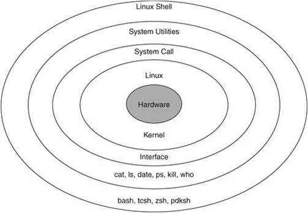
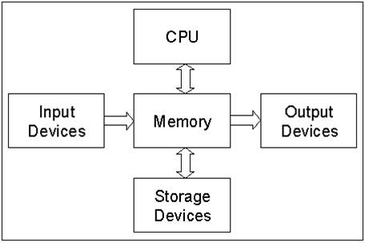
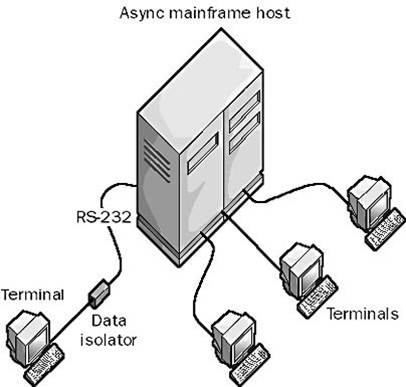

## Lecture 2

### 이론

  * 컴퓨터 구성 4대 요소: 하드웨어, 소프트웨어, 사용자, 데이터

  * 운영체제: 사용자가 하드웨어를 쓰기 좋게 만들어주는 시스템 소프트웨어

  * **리눅스에선 모든 resource를 파일로 관리한다** -> 커맨드나 기기에 대한 정보들도 파일로 관리한다.

    

  * Memory에는 Input과 Output device 사이에 존재하며 이를 위한 I/O buffer가 존재한다.
    
    

  * Terminal: 단말, 사용자와 직접적으로 맞닿아있는 종점으로 input 겸 output device이다.

    

  * cat
    리눅스 커맨드로 stdin으로 input을 받아 concatenate하여 stdout으로 출력함
    * `cat`: 키보드로 입력을 받아 모니터로 출력
    * `cat [파일명]`: 파일의 내용을 입력으로 받아 모니터로 출력
    * `cat [파일명] [파일명] ...`: 여러 개의 파일을 붙여 모니터로 출력

  * Redirection
    리눅스는 stdin(0), stdout(1), stderr(2)로 표준 입출력을 파일 형태로 열고 있다.

    Redirecion을 통해 파일이나 명령어 등의 출력을 다른 프로그램이나 명령어의 입력으로 이용이 가능하다.

    * `< [파일명]`, `0< [파일명]`: stdin의 내용으로 파일을 받음
    * `> [파일명]`, `1> [파일명]`: stdout의 내용을 파일로 저장
    * `2>`: stderr을 내용을 전달
    * `>>`: 기존 내용에 누적하여 redirection


### linux command

  |command|설명|
  |--|--------------------------|
  |cp|복사|
  |tty|현재 표준 입출력 장치에 연결되어 있는 터미널의 파일명을 보여준다.|
  |ps|현재 실행 중인 프로세스를 확인|
  |write|터미널을 통해 사용자에게 메시지를 보냄|
  |wall|wrtie all, 터미널을 통해 모든 사용자들에게 메시지를 보냄|
  |mesg [n/y]| 메시지 수신 여부 설정|
  |man|명령어에 대한 정보를 확인|
  |date|날짜에 대한 정보를 확인|
  |diff|파일 비교|
  |strings|파일 내에서 사람이 읽을 수 있는 부분 출력|
  |sleep|지정한 시간만큼 대기|
  |jobs|background에 존재하는 작업과 상태 확인|
  |ctrl+c|현재 실행 중인 프로세스를 kill|
  |ctrl+z|현재 실행 중인 프로세스를 중지, background로 이동|
  |ctrl+d|EOF(End Of File), 파일을 끝냄|
  |[명령어] &|back ground에서 명령어 실행|
  |fg|background에 존재하는 프로세스 실행|
  |logout|ssh 종료|


  
### vi editor

* Normal mode
  |key|설명|
  |--|--------------------------|
  |%|해당 line의 괄호와 쌍을 이루는 괄호 위치로 이동|
  |/|입력한 내용 검색|

* Command mode
  |key|설명|
  |--|--------------------------|
  |set number|editor에서 line 번호 표시|
  

### 실습

* 파일 입출력
  1. shell에 `vi hello.c` 입력
  2. 아래 내용 입력 및 저장
    ```c
    #include <stdio.h>
    int main()
    {
      FILE *fout;
      fout = fopen("output.txt", "w");
      fprintf(fout, "Hello World\n");
      fclose(fout); // 닫는 것 중요!
      return 0;
    }
    ```
  3. shell에 `cc hello.c` 입력
  4. shell에 `./a.out` 입력
  5. `vi output.txt`를 통해 결과 확인 -> Hello World 내용이 저장된 `output.txt`파일이 생성됨


* Redirection
  * `whoami > ouput`: 현재 사용자의 계정을 `output`에 저장

  *  `whoami >> output`: 현재 사용자의 계정을 `output`에 추가

  *  파일 내용 합쳐서 저장
      1. `date > date.txt`를 통해 현재 시간에 대한 정보를 `date.txt`파일에 저장
      2. `cat date.txt hello.c output.txt > total.txt`을 통해  `date.txt`, `hello.c`, `output.txt`의 내용을 합쳐 `total.txt`로 저장

  * 파일 복사
    1. `cat hello.c hello.c hello.c > hello3`를 통해 `hello3` 파일 생성
    2. `cat < hello3 > hello4`을 통해 `hello3`의 내용을 `hello4`에 저장(복사)
    3. `diff hello3 hello4`을 통해 결과 비교(동일하므로 아무런 출력 없음)

  * stdin, stdout, stderr 테스트
    1. shell에 'vi hello.c` 입력
    2. 아래 내용 입력 및 저장
    ```c
    #include <stdio.h>
    int main()
    {
      int in_a;
      fscanf(stdin, "%d", &in_a);
      fprintf(stdout, "Hello stdout %d\n", in_a); // Comment
      fprintf(stderr, "Hello stderr %d\n", in_a); // Comment
      return 0;
    }
    ```
    3. shell에 `cc hello.c` 입력
    4. shell에 `./a.out 1> out.txt 2> err.txt` 입력 후 숫자 입력
    5. `vi out.txt`, `vi err.txt`를 통해 결과 확인 -> stdout의 내용은 `output.txt`에, stderr의 내용은 `err.txt`에 저장됨


  

