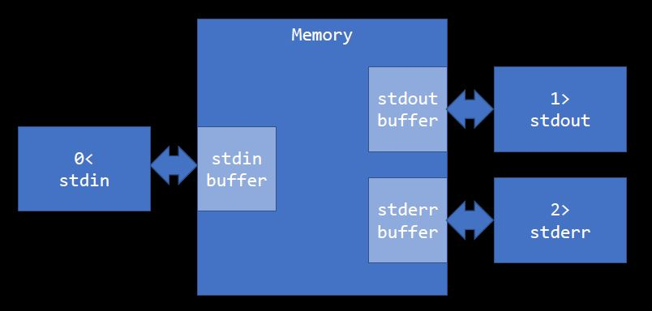
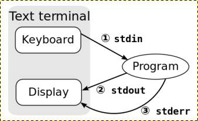

## Lecture 4

### 이론

  * Standard IO Stream

    
    
    * stdin, stdout, sterr은 buffer가 존재한다.
    * stdout과 stderr에서 먼저 나가는 순서는 예측이 불가능 하다 -> flush를 통해 제어 가능
    * 임의의 redirection을 생성할 수 있다. e.g) `6>`


  * Redirection

    

    * Here document, Here string
      * `0<<` or `<<`
        * 임시 파일을 만들어 stdin으로 연결
          ```
          $ cat << EOF
          > "200"
          > EOF
          "200"
          ```
          EOF가 나오기 전까지 입력을 받음
      
      *  `<<<` (bash only)
          * string을 stdin 입력으로 연결
            ```
            $ cat <<< $( echo -e "hello\nhere        string" )
            hello
            here        string
            ```
          
          * globbing이 발생하지 않는다.
            ```
            $ cat <<< *
            *
            ```
    
    * `>`, `>>`의 우측에 FD(File Descriptor) 올 경우 `&`를 붙여주어야 한다.
    * redirection 기호의 명령 행상 위치는 어디든 상관 없다.
      ```
      $ echo hello >&2
      hello
      $ echo >&2 hello
      hello
      ```
    
  * Pipe 
    * Pipe order of execution
      ```
      $ cmd1 | cmd2
      ```
      * cmd1과 cmd2는 **동시에 병렬로** 실행된다.
      * cmd1이 cmd2보다 빠르면 파이프에 write는 블록되고 더 이상 진행되지 않는다.
      * cmd2가 cmd1보다 빠르면 파이프로부터 read는 블록된다.
      * cmd1이 먼저 종료하면 파이프는 close되고 cmd2는 EOF로 인식해 종료한다.
      * cmd2가 먼저 종료하면 파이프는 close되고 cmd1은 다음번 write에 SIGPIPE 신호를 받게되고 종료된다.
    
    * Named pipe
      * 파이프는 자동으로 생성/소멸
      * Named pipe
        * mkfifo 명령으로 생성 - 파일처럼 생성됨
          ```
          $ mkfifo pipe
          ```
        * redirection으로 sending
      * 읽는 상대편이 없으면 block된다.
      * Buffer Control이 필요하다.
  
  * Type
    * C언어의 타입은 몇 byte로 크기가 정해지지 않고 컴퓨터와 컴파일러가 허용하는 범위의 크기를 가질 수 있다. (`limit.h`에서 확인 가능) -> 컴퓨터와 컴파일러에 따라 자료형의 크기가 다를 수 있다.
    * Three basic memory model in C
      * Automatic
      * Static
      * Manual
    * 음수의 표현 방법으로는 3가지 방법이 있다.
      * sign and magnitude
      * 2's complement -> 파이썬
      * 1's complement
    * `>> 1`(shift)은 /2와 동일하다.
    * 절대값이 같은 음수와 양수를 & 하면 결과값은 1이다.


### 실습
  
  * Globbing
    * `*`(wildcard)를 이용하여 전체 혹은 특정 조건의 파일을 찾는 것이 가능하다.
    * `?`를 통해 특정 글자 수를 파일명으로 갖는 파일 탐색이 가능하다.
    ```
    $ echo *   // 디렉토리 내 파일 출력(숨겨진 파일X)
    a.out hello.c report04.md

    $ echo a*   // a로 시작하는 파일 출력
    a.out

    $ echo *.c   // .c로 끝나는 파일 출력
    hello.c

    $ echo ?????   // 파일명이 5글자인 파일 출력
    a.out

    $ echo ??????*   // 파일명이 6글자 이상인 파일 출력
    hello.c report04.md

    $ echo [abc]*   // 파일이 a or b or c로 시작하는 파일 출력
    a.out

    $ echo [a-q]*   // 파일이 a~q로 시작하는 파일 출력
    a.out hello.c
    ```


  * Pipe
    1. 아래와 같은 내용으로 `hello.c`와 `hello2.c` 파일을 생성한다.
      * hello.c
        ```c
        #include <stdio.h>
        
        int main()
        {
          int in_a;
          fscanf(stdin, "%d, &in_a);
          fprintf(stdout, "Hello stdout %d\n", in_a);
          fprintf(stderr, "Hello stderr %d\n", in_a);
        }
        ```
      * hello2.c
        ```c
        #include <stdio.h>
        
        int main()
        {
          int in_a;
          fscanf(stdin, "%d, &in_a);
          fprintf(stdout, "Hello stdout %d\n", in_a);
        }
        ```
    2. `cc hello.c`와 `cc -o b.out hello2.c`를 통해 실행파일 `a.out`과 `b.out`을 생성한다.

    3. shell에 `a.out | b.out`을 입력 후 임의의 숫자를 입력한다.
        ```
        $ a.out | b.out
        111
        Hello stderr 111
        Hello stdout 111
        Hello stdout 111
        ```

    * Binary
      * 파이썬에서 binary number 확인
        1. shell에 `python` 입력
        2. `bin()` 괄호 안에 원하는 숫자 입력
        ```
        $ python
        Python 2.7.17 (default, Feb 27 2021, 15:10:58)
        [GCC 7.5.0 on linux2
        Type "help", "copyright", "credits" or "license" for more information.]
        >>> bin(5)
        '0b101'
        >>> bin(-5)
        '-0b101'
        >>> bin(5&(-5))
        '0b1'
        ```
      
      * binary number로 전환하는 c 코드 작성 및 실행
        1. 아래 내용과 같은 `binary.c` 파일 생성
            ```c
            #include <stdio.h>

            int main()
            {
              int i;
              int in_a;
              fscanf(stdin, "%d", &in_a);

              for(i = 0; i >= 0; i--)
              {
                fprintf(stdout, "%d", ((in_a >> 1) & 1));
                if(i % 4 == 0)
                  fprintf(stdout. " ");
              }
              fprintf(stdout, "\n");
            }
            ```
        2. `cc -o bin binary.c`를 통해 실행파일 `bin` 생성
        3. `./bin`을 통해 실행
            ```
            $ ./bin
            5
            0000 0000 0000 0000 0000 0000 0000 0101
            $ ./bin
            -5
            1111 1111 1111 1111 1111 1111 1111 1011
            ```

