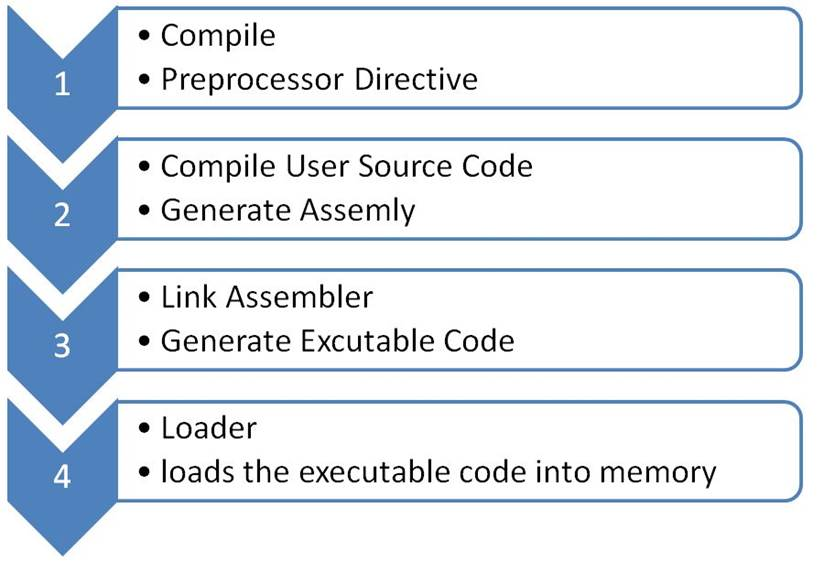
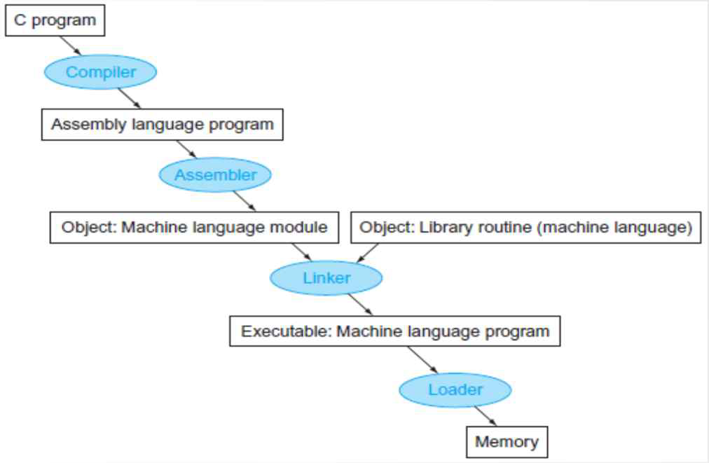

## Lecture 07

### 이론
  * Pointer
    * `int const *` vs `int * const`
      * `int const *`: 상수 정수형 (int value는 변할 수 없음)
      * `int * const`: 상수 포인터로 변수는 integer (int value는 변할 수 있음) 
  
  * 함수 Pointer
    * 함수의 pointer의 선언은 `[타입] (*[포인터명])([매개변수1], ...)`와 같은 방법으로 사용이 가능하다.

      e.g) `void (*fp)();`
    * 함수의 매개변수를 입력해주지 않아도 사용이 가능하지만 매개변수를 입력해 줄 경우 디버그가 쉽다는 장점이 있다.
    * 함수의 pointer가 가르키는 함수을 설정해 줄 때, 함수명을 그대로 써도 되고 &를 붙여서 써도 된다. 그러나 함수 뒤에 괄호가 있으면 안된다.
      
      e.g) `fp = add;`,  `fp = &add;`
    * 함수의 pointer는 배열의 형태로도 사용이 가능하다.
      
      e.g) `void (*fp[4])(int *, int *, int *)`

  * C Compiler
    * C compile and Execution

        
        * Program language를 Machine language로 변환하는 과정이다.
        * Preprocessing은 `#define`, `#include` 등을 처리하는 과정이다.
        * 한 줄씩 -> interpreter / 한 번에 전체 -> compiler
        * link에는 dynamic link와 static link가 존재하며 상황에 따라 성능의 차이가 발생한다.
          * dynamic link: 실행 파일을 만들 때 모듈을 추가하지 않고 link를 사용하는 방법 -> 메모리 부담 감소
          * static link: 실행 파일을 만들 때 라이브러리를 같이 포함시켜서 .exe파일을 만든다. -> 컴파일 시간 단축/메모리 부담 증가
        * 새로운 컴파일을 하면서 기존에 동일한 실행파일이 있다면 로더가 이를 삭제한다.
        * 코드 내 주소는 실행파일이 실행될(loading) 때 결정된다.
        * 여러 파일을 묶어서 컴파일 및 실행을 할때 특정 c파일에 변동이 없었다면 해당 .c파일이 만들어 놓은 기존의 .o파일을 사용하여 컴파일 시간을 줄일 수 있다.

    * gcc compile option
      ```
      gcc [-c|-S|-E] [-std=standard]
           [-g] [-pg] [-Olevel]
           [-Wwarn...] [-Wpedantic]
           [-Idir...] [-Ldir...]
           [-Dmacro[=defn]...] [-Umacro]
           [-foption...] [-mmachine-option...]
           [-o outfile] [@file] infile...
      ```
      * `-c` : .o 파일(실행 파일) 생성
      * `-g` : for debug (성능 저하의 우려로 실사용 X)
      * `-O` : optimization (최적화를 위해 코드 내 불필요한 것 제거&코드 순서 변경)
      * `-E` : preprocessing 생성
      * `-pg` : for profile
      * `--32` or `--64` : 32비트 혹은 64비트 설정 (단, 64비트로 컴파일 시 32비트 기기에서 실행에 문제 발생)

    * CPP (C Preprocessor)
      * Macro Processor for C, C++, Objective-C
        1. Include head files
            * #include file as text
            * gcc Option -I
              * Include location - `.`, `/usr/include`
                * `stdio.h`의 위치는 `/usr/include`
            * Prevent multiple include
              * `#pragma once` 
              * ```
                #ifdef _MATH_
                #include <math.h>
                #endif
                ```
        2. Define macro
            * `#define <identifier> <replacement token list>  // object`
            * `#define <identifier> (<parameter list>) <replacement token list> // function-macro`
            * `#define`을 이용하여 매크로 함수를 생성할 때 변수에 괄호를 사용해야 한다. (괄호 미사용 시 문제 발생 가능)

              e.g) `#define DF(a) ((a)*(a))`
        3. Conditional Compilation
        4. Line Control


### linux command

  |command|설명|
  |--|--------------------------|
  |od|바이너리 파일의 내용을 확인|

### 실습
  * Pointer
    * `int const *` vs `int * const`
      1. 아래와 같이 const로 선언한 a가 가르키는 값을 바꿔보는 코드를 실행한다.
          ``` c
          #include <stdio.h>

          void add(int *a, int *b, int *c)
          {
	          *c = *a + *b;
          }

          int main()
          {
              int const a = 100;
              int b = 200;
              int c = 999;
              int *p = &a;
              fprintf(stdout, "a,b,c: %d %d %d\n", a, b, c);
              *p = 200;
              fprintf(stdout, "a,b,c: %d %d %d\n", a, b, c);
          }
          ```
          결과
          ```
          $ cc fnpointer.c
          In function ‘main’:
          fnpointer.c:13:11: warning: initialization discards ‘const’ qualifier from pointer target type [-Wdiscarded-qualifiers]
          int *p = &a;
                   ^
          $ a.out
          a,b,c: 100 200 9999
          a,b,c: 200 200 9999
          ```
          컴파일 시 실행은 되지만 warning이 뜬다. 또한 포인터를 통해 a의 값을 바꿀 수 있었다. 이를 통해 사용자에게 const로 설정한 value가 바뀌었음을 알려줄 수 있다.
    
      2. 아래와 같이 포인터를 int const로 변경하여 코드를 실행한다.
          ``` c
          #include <stdio.h>

          void add(int *a, int *b, int *c)
          {
	          *c = *a + *b;
          }

          int main()
          {
              int const a = 100;
              int b = 200;
              int c = 999;
              int const *p = &a;
              fprintf(stdout, "a,b,c: %d %d %d\n", a, b, c);
              *p = 200;
              fprintf(stdout, "a,b,c: %d %d %d\n", a, b, c);
          }
          ```
          결과
          ```
          $ cc fnpointer.c
          In function ‘main’:
          fnpointer.c:16:5: error: assignment of read-only location ‘*p’
          *p = 200;
             ^
          ```
          상수로 선언된 정수를 바꾸려했기 때문에 error가 나고 컴파일되지 않는다.
      3. 위의 코드에서 `int const *p`를 `int * const p`로 변경하여 코드를 실행한다.
         결과
          ```
          $ cc fnpointer.c
          In function ‘main’:
          fnpointer.c:13:18: warning: initialization discards ‘const’ qualifier from pointer target type [-Wdiscarded-qualifiers]
          int * const p = &a;
                          ^
          $ a.out
          a,b,c: 100 200 9999
          a,b,c: 200 200 9999
          ```
          1번과 마찬가지로 warning과 함께 실행파일이 생성된다.

      4. 아래와 같이 포인터의 연결을 바꿔주는 코드를 추가해 실행한다.
          ``` c
          #include <stdio.h>

          void add(int *a, int *b, int *c)
          {
	          *c = *a + *b;
          }

          int main()
          {
              int const a = 100;
              int b = 200;
              int c = 999;
              int * const p = &a;
              fprintf(stdout, "a,b,c: %d %d %d\n", a, b, c);
              p = &b;
              *p = 200;
              fprintf(stdout, "a,b,c: %d %d %d\n", a, b, c);
          }
          ```
          결과
          ```
          fnpointer.c: In function ‘main’:
          fnpointer.c:13:18: warning: initialization discards ‘const’ qualifier from pointer target type [-Wdiscarded-qualifiers]
          int * const p = &a;
                          ^
          fnpointer.c:16:4: error: assignment of read-only variable ‘p’
          p = &b;
            ^
          ```
          상수로 선언한 포인터를 변경하였기 때문에 error가 노출되며 컴파일되지 않는다.

  * 함수 Pointer
    * 아래와 같이 함수의 포인터 배열과 switch문을 통해 덧셈, 뺄셈, 곱셈, 나눗셈을 동작하는 코드를 만들 수 있다.
      ```c
      #include <stdio.h>

      void add(int *a, int *b, int *c)
      {
	      *c = *a + *b;
      }

      void sub(int *a, int *b, int *c)
      {
	      *c = *a - *b;
      }

      void div(int *a, int *b, int *c)
      {
	      (*c) = (*a) / (*b);
      }
	
      void mul(int *a, int *b, int *c)
      {
	      (*c) = (*a) * (*b);
      }

      int main()
      {
	      int a = 100;
	      int b = 200;
	      int c = 9999;
	      char ch;
	      int op = 0;
      
	      fscanf(stdin, "%d %c %d", &a, &ch, &b);
	
	      //fprintf(stdout, "a,b,c: %d %d %d\n", a, b, c);
	      void (*fp[4])(int *, int *, int *) = {add, sub, mul, div};

	      switch(ch)
	      {
		      case '+':
			      op = 0;
			      break;

		      case '-':
			      op = 1;
                  break;
		      case '*':
			      op = 2;
			      break;

		      case '/':
			      op = 3;
			      break;
	      }
	      fp[op](&a,&b,&c);
	      fprintf(stdout, "a,b,c: %d %d %d\n", a, b, c);
      } 
      ```

  * C compiler
    * 아래와 같이 `func.h`, `func.c`, `main.c`를 생성하여 `gcc main.c func.c`를 입력하면 여러 파일의 컴파일이 가능하다.
      * func.h
          ```c
          #define DF(a) ((a)*(a))
          extern int func1(int x);
          ```
      * func.c
          ```c
          #include "func.h"
          int func1(int a)
          {
            return (a*10);
          }
          int func2(int a)
          {
            return (a*2);
          }
          ```
      * main.c
          ```c
          #include <stdio.h>
          #include "func.h"

          int main()
          {
            printf("func1 %d %d\n" func1(100), DF(10));
          } 
          ```
      결과

        ```
        $ a.out
        func1 1000 100
        ``` 
    * 위의 `main.c`에서 `func1(100)`을 `func2(100)`으로 수정해서 컴파일시키면 func2는 extern으로 선언되지 않아 warning 혹은 error가 발생한다. 따라서 `main.c`에서 `func2` 함수를 사용하기 위해서는 `func.h`파일에 `extern int func2(int x);`를 추가해 주어야 한다.
      ```
      $ gcc main.c func.c
      main.c: In function ‘main’:
      main.c:7:26: warning: implicit declaration of function ‘func2’; did you mean ‘func1’? [-Wimplicit-function-declaration]
      printf("func2 %d %d\n", func2(100), DF(10));
                              ^~~~~
                              func1
    * `cc -E`를 이용하여 preprocessing 결과를 확인 할 수 있다.
      ```
      $ cc -E func.c
      # 1 "func.c"
      # 1 "<built-in>"
      # 1 "<command-line>"
      # 31 "<command-line>"
      # 1 "/usr/include/stdc-predef.h" 1 3 4
      # 32 "<command-line>" 2
      # 1 "func.c"
      # 1 "func.h" 1

      extern int func1(int x);
      extern int func2(int x);
      # 2 "func.c" 2

      int func1(int a)
      {
        return (a*10);
      }

      int func2(int a)
      {
        return (((a)*(a))*2);
      }
      ```

    * `#define`과 `#if`를 이용해 동일한 이름의 함수를 조건에 따라 다르게 사용할 수 있도록 구성할 수 있다.
      * func.c
        ```c
        #include "func.h"

        #if FUNCTION_NEGATIVE == 1

        int func1(int a)
        {
          return (a*10);
        }

        #else
        int func1(int a)
        {
          return DF(a+1) * 20;
        }

        #endif
        ```
      * main.c
        ```c
        #define FUNCTION_NEGATIVE 0 //include 되기 전에 해야함
        #include <stdio.h>
        #include "func.h"

        int main()
        {
	        printf("func1 %d %d\n", func1(100), DF(10));
        }
        ```
      결과
        ```
        $ a.out
        func1 204020 100
        ```

    * 일부 코드의 내용을 사용하고 싶지 않다면 `#if 0`, `#endif`를 사용하면 된다.
      ```c
      #if 0
      int func2(int a)
      {
	      return (DF(a)*2);
      }
      #endif
      ```


