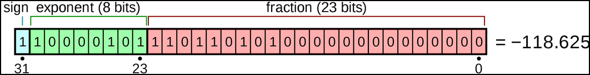

## Lecture 08

### 이론
  * C compiler
    * Macro definition
      * `\`을 사용하면 줄을 내려서 사용할 수 있다. (tab 키 이용시 tab의 내용이 들어갈 수 있음)
        
        e.g)
        ```
        #define NUMBERS 1, \
                        2, \
                        3
        ```
      * 코드 내 어느 부분에서도 사용이 가능하며, 동일한 내용을 여러 번 define 했다면 직전에 define한 내용이 반영된다.
      * 삼항 연산자를 이용하여 macro처럼 함수를 사용하는 것이 가능하다. (if문을 사용하는 것보다 성능적으로 우수함)
        
        e.g)
        ```
        #define min(x,y) ((x) < (y) ? (x) : (y))
        ```
      * 어떠한 값이든 들어가도록 함수의 argument를 비워놓은 것을 omit parameter라고 하며 argument의 개수는 맞춰주어야 한다.
        * `min( ,b) -> (() < (b) ? () : (b))`
        * `min(a, ) -> ((a) < () ? (a) : ())`
        * `min( , ) -> (() < () ? () : ())`
        * `min((, ), ) -> ((, ) < () ? ((,)) : ())`
        * `min()`은 한 개의 argument만 들어갔기 때문에 error가 발생한다.
        * `min(,,)`은 세 개의 argument가 들어갔기 때문에 error가 발생한다.
      * `error`를 입력하여 프로그램의 error을 발생시킬 수 있다.
        
        e.g) version이 2일 때 오류를 발생시키는 예
        ```
        #ifdef _VERSION_
        #if _VERSION_ >= 3 
            printf("Version is greater or equal than 3\n");
        #elif _VERSION_ == 2
        #error VERSION 2 IS NOT SUPPORTED
        #endif
        #endif // ifdef _VERSION_
        ```

    * Order Expansion of Function Macro
      * Stringfication(#) operation:argument의 대체 리스트의 텍스트 표현으로 대체된다. (without performing expansion)
      * Parameters: 대체 리스트로 대체된다. (without performing expansion)
      * Concatenation operations: 두 operand의 연결된 결과로 대체된다. (without performing the resulting token)
      * parameter에서 온 token들은 확장된다.
      * result token은 normal하게 확장된다.

      -> macro에 순서가 있고 과정이 복잡하기 때문에 아무렇게 macro를 사용하는 것은 좋지 않다.
    
    * Special Macro and Directives
      * `__FILE__`: 파일의 이름
      * `__LINE__`: 현재 라인의 넘버
      * 주로 debug 용도로 사용된다.
      * `#define`을 통해 `__LINE__`의 값을 설정하게 된다면 이후의 라인 넘버가 변하지 않는다.
    
    * Token stringication #
      * `#`을 붙이면 string으로 변환된다.

    * Token Concatenation
      * `##`을 붙이면 띄어쓰기 없이 문자열을 붙일 수 있다.
        ```
        #define DECLARE_STRUCTURE_TYPE(name) typedef struct name##_s name##_t

        DECLARE_STRUCTURE_TYPE(g_object); 
            // Outputs: typedef struct g_object_s g_object_t;
        ```
    
    * GCC options
      |Option|Meaning|
      |-----|-----|
      |`-E`|Preprocess만 실행. compile, assemble, link 하지 않음.|
      |`-S`|Compile만 실행. assemble, link 하지 않음. `.s`파일 생성.|
      |`-c`|Compile과 assemble 실행. link 하지 않음.|
      |`-o <file>`|결과(실행 파일)을 `<file>`로 생성. " `.o`파일 생성.|
      * ".s" 파일은 X86의 어셈블리 파일이다.

    * GCC Optimization
      |Option|Meaning|
      |-----|-----|
      |`-O0`(default)|최적화를 수행하지 않는다.|
      |`-O` `-O1`|코드 크기와 실행 시간을 줄이는 것을 제외한 최적화는 실행하지 않는다.|
      |`-O2`|메모리 공간과 속도를 희생하지 않는 범위 내의 모든 최적화를 수행한다. loop unrolling과 function inlining에 대한 최적화를 수행하지 않는다.|
      |`-O3`|O2 최적화에 인라인 함수와 레지스터에 대한 최적화를 추가로 수행한다.|
      |`-Os`|O2 최적화 기능을 사용하지만, 코드 크기를 증가시키는 최적화는 생략한다.|

    * CPP preprocessing
      * Character set: utf-8 (unicode)
      * Initial processing
        1. LF, CR LF and CR processing
           * LF: Line Feed(\n), 커서는 그 자리에 둔 상태로 종이만 한 줄 올려 줄을 바꾸는 동작
           * CR: Carriage Return(\r), 현재 커서를 줄 올림 없이 가장 앞으로 옮기는 동작
           * CRLF: 두 동작을 합쳐 새로운 줄로 바꾸는 방식을 말함
            * Windows에서는 CRLF을 기본으로 사용하는 반면, Unix/Linux에서는 LF만으로 줄바꿈을 한다.
        2. if-trigraphs
        3. long line with "\" -> merge
        4. All comments -> ""
      * Tokeniztion with space
      * Preprocessing language (lec07의 Macro Processor for C, C++, Objective-C 내용 참고)


### 실습
  * Macro definition
    * 아래 코드 통해 Macro 내에 어떤 작업이 먼저 수행되는 지를 확인할 수 있다.
      ```c
      #define HE HI
      #define LLO _THERE
      #define HELLO "HI THERE"
      #define CAT(a,b) a##b
      #define XCAT(a,b) CAT(a,b)
      #define CALL(fn) fn(HE,LLO)
      CAT(HE,LLO) // "HI THERE", because concatenation occurs before normal expansion
      XCAT(HE,LLO) // HI_THERE, because the tokens originating from parameters ("HE" and "LLO") are expanded first
      CALL(CAT) // "HI THERE", because parameters are expanded first
      ```
      결과 (Preprocess의 결과를 확인해야 하므로 `cc -E` 사용)
      ```
      $ cc -E macrotest.c
      # 1 "macrotest.c"
      # 1 "<built-in>"
      # 1 "<command-line>"
      # 31 "<command-line>"
      # 1 "/usr/include/stdc-predef.h" 1 3 4
      # 32 "<command-line>" 2
      # 1 "macrotest.c"


      "HI THERE"
      HI_THERE
      "HI THERE"
      ```
      특정 연산을 먼저 수행하기 때문에 출력되는 내용을 예상하기가 쉽지 않다. 따라서 macro를 사용할 때 이를 주의해야 한다.
    
    * Token Concatenation
      ```c
      #define sq(a) a*a
      sq(B)
      #define sq(a) a##a##a
      sq(C)
      ```
      결과 (Preprocess의 결과를 확인해야 하므로 `cc -E` 사용)
      ```
      $ cc -E macrotest.c
      # 1 "macrotest.c"
      # 1 "<built-in>"
      # 1 "<command-line>"
      # 31 "<command-line>"
      # 1 "/usr/include/stdc-predef.h" 1 3 4
      # 32 "<command-line>" 2
      # 1 "macrotest.c"


      macrotest.c:13:0: warning: "sq" redefined
      #define sq(a) a##a##a

      macrotest.c:11:0: note: this is the location of the previous definition
      #define sq(a) a*a


      B*B

      CCC
      ```
      `##` 이용하여 concatenate가 된 것을 확인할 수 있다.

    * GCC options 
      1. 아래와 같은 내용의 `hello.c` 파일을 생성한다.
          ```c
          #include <stdio.h>

          void add(int *a, int *b, int *c)
          {
	          *c = *a + *b;
          }
	
          int main()
          {
              int a = 100;
	          int b = 200;
              int c = 999;
              // int * == long long
	
	          fprintf(stdout, "%d : %lld %llx\n", a, (long long)&a, (long long)&a);
              fprintf(stdout, "%d : %lld %llx\n", b, (long long)&b, (long long)&b);
	          add(&a, &b, &c);
	          // c = a + b;
	          fprintf(stdout, "%s %d : %d\n", __FILE__, __LINE__,c); // 파일과 라인을 파악할 수 있음
	          fprintf(stdout, "%s %d : %d\n", __FILE__, __LINE__,c);
	          fprintf(stdout, "%s %d : %d\n", __FILE__, __LINE__,c);
          }
          ```
      2. `cc -E`를 통해 hello.c을 Preprocess한 파일(`hellocpp.c`)을 생성한다.
          ```
          $ cc -E hello.c > hellocpp.c
          $ vi hellocpp.c
          # 1 "hello.c"
          # 1 "<built-in>"
          # 1 "<command-line>"
          # 31 "<command-line>"

          // 중간 생략 ... //

          int main()
          {   
              int a = 100;
              int b = 200;
              long long c = 999;


               fprintf(
              # 15 "hello.c" 3 4
                      stdout
              # 15 "hello.c"
                            , "%d : %lld %llx\n", a, &a, &a);
              fprintf(
              # 16 "hello.c" 3 4
                      stdout
              # 16 "hello.c"
                            , "%d : %lld %llx\n", b, &b, &b);
              add(&a, &b, &c);

              fprintf(
              # 19 "hello.c" 3 4
                       stdout
              # 19 "hello.c"
                            , "%d : %lld %llx\n", c, &c, &c);
              fprintf(
              # 20 "hello.c" 3 4
                      stdout
              # 20 "hello.c"
                            , "%d : %lld %llx\n", c, (&c)+1, &c+1);
              fprintf(
              # 21 "hello.c" 3 4
                      stdout
              # 21 "hello.c"
                            , "%d : %lld %llx\n", c, (&c)+2, &c+2);
          }
          ```


      3. `cc -S`를 통해 hellocpp.c의 어셈블리 파일(`hellocpp.s`)을 생성한다.
            ```
            $ cat hellocpp.s
	                .file	"hellocpp.c"
	                .text
	                .globl	add
	                .type	add, @function
            add:
            .LFB0:
	                .cfi_startproc
	                pushq	%rbp
	                .cfi_def_cfa_offset 16
                    //이하 생략
            ```


---
### Project
 * 부동소수점
   * 컴퓨터에서 소수점을 나타낼 때 가장 많이 쓰이는 표준 
   
     1. -118.625는 음수이기 때문에 앞에 1이 붙으며 118.625의 절대값을 이진법으로 나타내면 1110110.101이 된다.
     2. 소수점을 왼쪽으로 이동시켜 왼쪽에 1만 남게 만든다.
     3. 오른쪽 부족한 비트는 0으로 채운다.
     4. 지수는 6이고 Bias는 127이므로 6+127인 133을 이진수로 나타내면 10000101이 된다. 이 수는 exponent가 된다.

     * floating point로 encoding된 수를 10진수로 돌리기 위해서는 `((-1)^S) * Mantissa * (2^(Exponent-127))`을 해준다.
     
 * 고정소수점
   * 소수점을 고정한 상태로 소수를 나타내는 방식
   * 32bit에서 16bit를 소수로 사용한다면 2^(-16)을 곱해주면 된다.

   ```c
   #include <stdio.h>
   #include <math.h>
   // #### #### #### #### #### #### #### ####
   // S 15 . 16
   #define FX_Q_NUM 16

   int main() {
     int ia;
     float fa;
     fscanf(stdin, "%d", &ia);
     fprintf(stdout, "%d: %f %f\n", ia, (float)ia, (float)ia * (float)powf(2.0f, -16));
     fscanf(stdin, "%f", &fa);
     fprintf(stdout, "%f: %d %d\n", ia, (int)ia, (int)ia * (int)powf(2.0f, 16));
   }
   ```
   * python에서 `2**<지수>`를 입력하여 나온 결과를 상수로 사용한다면 `<math.h>`라이브러리를 사용하지 않고 고정소수점을 나타낼 수 있다.
   ```c
   #define FX_2_MINUS_16 1.52587890625e-05F
   ```


