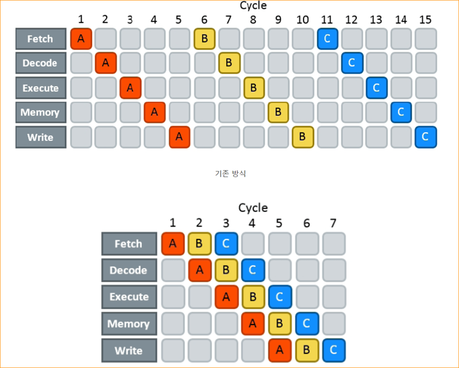
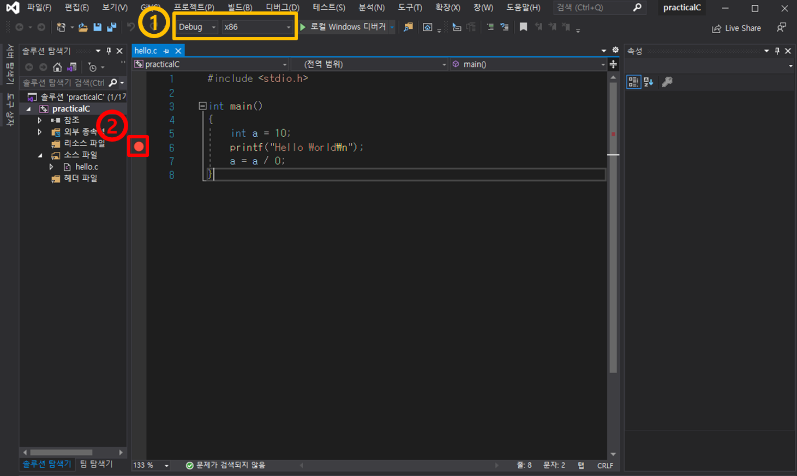
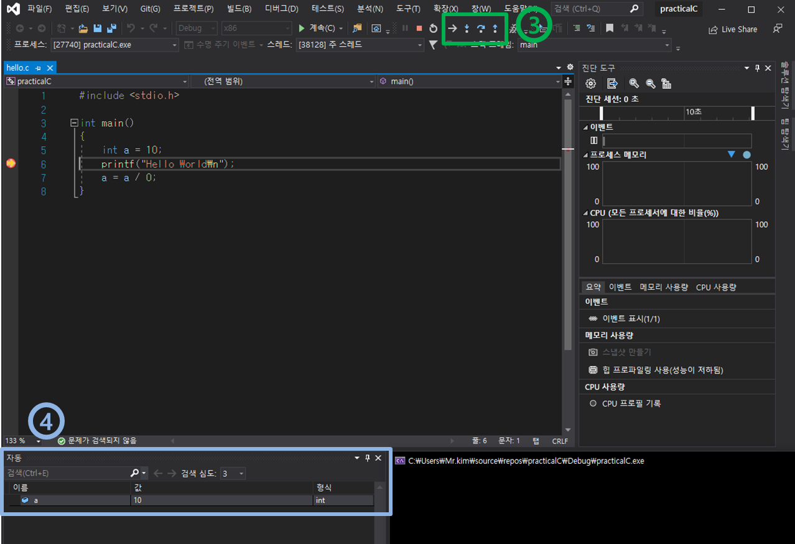
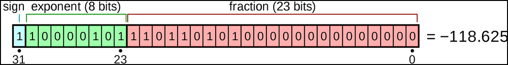

## report10

### 이론
  * Optimization
    * Profiling
      * 성능 분석이라고도 하며 프로그램의 시간 복잡도 및 공간, 특정 명령어 이용, 함수 호출 주기와 빈도 등을 측정하는 과정
      * 성능 분석을 위해서는 충분히 많은 시행을 해야한다.
      * 함수의 호출은 cost가 크다.
      * profile의 결과는 환경의 영향을 받아 오차를 발생할 수 있다.

    * What makes different performance
      * Golden Rule
        * Speed: CPU > Memory > Storage > IO > Human
        * Register > Cache(1st, 2nd) > Memory > ...
        * Locality
          근처에 있는 메모리를 쓰는 것이 성능에 좋다.
        * Pipeline
          * 프로세서에서 성능을 높이기 위해 명령어 처리를 여러 단계로 나누어 동시에 수행하여 병렬화 시키는 것
          * 그러나 brach(조건문)이 있다면 pipeline을 통해 최대의 효율을 얻을 수 없다.

          
        * Error

      * Depend on HW
        * 기기에 따라 연산을 수행하는 데 필요한 cycle이 다르다.
        * 주로 -, +, >>, <<, >는 one cyle에 처리가 가능하지만 *, /연산은 더 많은 cycle을 필요로 한다.
        * floating point 연산은 비교적 느린 속도를 보여준다.
        * I/O를 수행하는 시간은 길다.

    * gprof - GNU Profiling
      * GNU Profiler
        ```
        NAME
            gprof - display call graph profile data

        SYNOPSIS
            gprof [ -[abcDhilLrsTvwxyz] ] [ -[ACeEfFJnNOpPqQZ][name] ] 
            [ -I dirs ] [ -d[num] ] [ -k from/to ] [ -m min-count ] [ -R map_file ]
	        [ -t table-length ] [ --[no-]annotated-source[=name] ] 
            [ --[no-]exec-counts[=name] ] [ --[no-]flat-profile[=name] ] 
            [ --[no-]graph[=name] ] [ --[no-]time=name] [ --all-lines ] 
            [ --brief ] [ --debug[=level] ] [ --function-ordering ]
            [ --file-ordering map_file ] [ --directory-path=dirs ]
            [ --display-unused-functions ] [ --file-format=name ]
            [ --file-info ] [ --help ] [ --line ] [ --inline-file-names ]
            [ --min-count=n ] [ --no-static ] [ --print-path ]
            [ --separate-files ] [ --static-call-graph ] [ --sum ]
            [ --table-length=len ] [ --traditional ] [ --version ]
            [ --width=n ] [ --ignore-non-functions ] [ --demangle[=STYLE] ] [ --no-demangle ]
            [--external-symbol-table=name] [ image-file ] [ profile-file ... ]
        ```


### 실습
  * visual studio에서의 debug

    

    1. 상단의 드롭다운 리스트를 통해 Debug와 Release, x86과 x64로의 설정이 가능하다.
        * Debug는 `cc -g`와 동일
    2. breakpoint는 코드의 왼쪽 바를 클릭하여 설정할 수 있고, 설정 시 위의 사진처럼 빨간 원으로 표시된다.

    

    3. Debug 모드에선 위의 버튼들을 통해 코드를 실행시킬 수 있으며 각 버튼의 의미는 다음과 같다.
        * 다음 문 표시
        * 한 단계씩 코드 실행
        * 프로시저 단위 실행
        * 프로시저 나가기
    4. 현재 프로그램 내의 값들을 확인 할 수 있다.
    
  * gprof
    1. `cc -gp <profile할 파일>`을 통해 실행파일을 만든다.
    2. 실행파일을 실행시킨다.
    3. `gprof <실행파일> gmon.out`을 입력한다.
        ```
        $ cc -pg test.c
        $ a.out
        $ gprof a.out gmon.out
        ```
      * 프로그램과 함수 호출에 걸린 시간을 확인할 수 있다.
      * `-b` 옵션을 추가하여 간략하게 결과를 볼 수 있다.


---
### Project
* 고정소수점 프로젝트
  * 숫자의 표현
    * 기본 자료형 C
      * [unsigned, signed] X [long long, int (long), short, char]
      * float, double, (half, quad)
    * 예1: unsigned char - 8bits
      
      |b7|b6|b5|b4|b3|b2|b2|b1|b0|
      |-|-|-|-|-|-|-|-|-|
      |x|x|x|x|x|x|x|x|x|

      * val = b7*(2^7) + b6*(2^6) + b5*(2^5) + b4*(2^4) + b3*(2^3) + b2*(2^2) + b2*(2^2) + b1*(2^1) + b0*(2^0)
    * 예2: sigend char - 8bits
    
      |b7(부호)|b6|b5|b4|b3|b2|b2|b1|b0|
      |-|-|-|-|-|-|-|-|-|
      |x|x|x|x|x|x|x|x|x|

      * sign bit가 1이면 2의 보수로 변경
        * b7 == 1이라면 val = -(b6*(2^6) + b5*(2^5) + b4*(2^4) + b3*(2^3) + b2*(2^2) + b2*(2^2) + b1*(2^1) + b0*(2^0))
        * b7 != 1이라면 val = b6*(2^6) + b5*(2^5) + b4*(2^4) + b3*(2^3) + b2*(2^2) + b2*(2^2) + b1*(2^1) + b0*(2^0)
    * float(IEEE 754)
      * float
        * sign 1bit, exp 8bits(bias = 127), mantissa or fraction 23bits
        
        * (sign * -2 + 1) * (1.0 + fraction * (2^(-23))) * (2^(exp-127))
    * 예3: fixed FX_S03_04 (Q=4)

      |b7(부호)|b6|b5|b4 **.**|b3|b2|b2|b1|b0|
      |-|-|-|-|-|-|-|-|-|
      |x|x|x|x **.**|x|x|x|x|x|

      * sign bit가 1이면 2의 보수로 변경
        * b7 == 1이라면 val = -(b6*(2^2) + b5*(2^1) + b4*(2^0) + b3*(2^(-1)) + b2*(2^(-2)) + b2*(2^(-3)) + b1*(2^(-4)) + b0*(2^(-5)))
        * b7 != 1이라면 val = b6*(2^2) + b5*(2^1) + b4*(2^0) + b3*(2^(-1)) + b2*(2^(-2)) + b2*(2^(-3)) + b1*(2^(-4)) + b0*(2^(-5))
        * val = 정수로 표현된 값(ival) * (2^(-q))

  * 사칙연산
    * 덧셈/뺄셈
      * v = v_a + v_b = iv_a * (2^(-q))  + iv_b * (2^(-q)) = (iv_a + iv_b) * (2^(-q)) 🡪 iv = iv_a + iv_b 
    * 곱셈
      * v = v_a * v_b = iv_a * (2^(-q))  * iv_b * (2^(-q)) = (iv_a * iv_b) * (2^(-2q)) 🡪 iv = iv_a * iv_b * (2^(-q))
    * 나눗셈
      * v = v_a / v_b = iv_a * (2^(-q))  / iv_b * (2^(-q)) = (iv_a / iv_b) 🡪  iv = iv_a / iv_b * (2^q) 🡪  iv = iv_a * (2^q) / iv_b 

  * 조건부 compile
    * `#define FX_SYSTEM_INTEGER 32&64`
    * `#define FX_POINT`
    * `#define FX_OP_PREFERENCE, FX_OP_FLOAT, FX_OP_PRECISION, FX_OP_FAIR, FX_OP_PERFORMANCE`
  * Fixed point arithmetic
    * 연산 - 덧셈/뺄셈/곱셈/나눗셈 (특히, 곱셈에 대해서 성능/정밀도 분석 필요->function과 macro 개발->오류에 대한 처리)
    * 함수 - Sine, Cosine, Tan, Sqrt
    * 변환 - from/to {double, float, int, short, long long, char}
    * 상수 - PI, 1/PI, e, log 10, log 2.2^q, 1/2, (자주 쓰이는 숫자)
  * Fixed point typedef
    * S_XX_YY fixed point number
      * s: 부호비트, XX: 소수점 위 비트 수, YY: 소수점 아래 비트 수
        ```
        // fx_u08_08 - unsigned 8bits . 8bits
        // fx_s16_15 - signed 16bits . 15bits
        ```
      * 실제 구현은 int 혹은 long long을 사용하여 구현
      * 실제 값은 val / (2^YY)
      * 예 : typedef int fx_s16_15;

