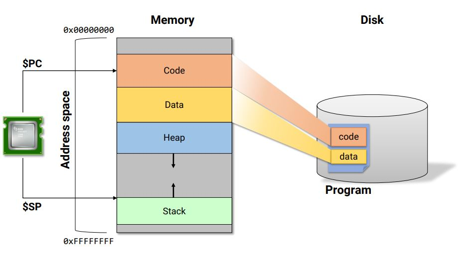

## report11

### 이론

  * Call by value, Call by reference
    * Call by value
      ```c
      #include <stdio.h>

      int add1 (int a, int b) 
      {
          int c = a + b;
          return c;
      }

      int main()
      {
          int x;
          int y;
          int z;

          fscanf(stdin, "%d %d", &x, &y);
          z = add1(x, y);
          fprintf(stdout, "%d\n", z);
          return 0;
      }
      ```
      * 위의 main에서처럼 `add1`함수를 호출할 때 매개변수로 value를 넣어주는 방법
      * `add1`과 `main`의 지역변수는 stack 영역에 저장되며 함수가 종료되면 사라진다.
      * `add1`과 `main`의 지역변수들이 가르키는 주소값들은 다르다. (`add1`함수를 통해 z는 c와 같은 값을 같지만 같은 주소를 갖는 것은 아니다.)
    
    * Call by reference
      ```c
      #include <stdio.h>

      void add2 (int *a, int *b, int *c) 
      {
          *c = *a + *b;
      }

      int main()
      {
          int x;
          int y;
          int z;

          fscanf(stdin, "%d %d", &x, &y);
          add2(&x, &y, &z);
          fprintf(stdout, "%d\n", z);
          return 0;
      }
      ```
      * 위의 main에서처럼 `add2`함수를 호출할 때 매개변수로 reference를 넣어주는 방법
      * 해당 변수를 가르키는 reference를 전달하기 때문에 호출한 함수에서 값이 변하여도 `main`에서의 변수에 영향을 준다.
      
    * Static & 전역 변수


      

      
      * stack영역에 저장되는 지역변수나 매개변수와 다르게 **data영역**에 저장된다.
      * static 변수는 외부 참조가 되지 않는다.
      * static 변수는 매개변수로 사용할 수 없다.
      ```c
      #include <stdio.h>
      
      int z;

      void add2 (int *a, int *b) 
      {
          z = *a + *b;
      }

      int main()
      {
          int x;
          int y;

          fscanf(stdin, "%d %d", &x, &y);
          add2(&x, &y);
          fprintf(stdout, "%d\n", z);
          return 0;
      }
      ```
      * 전역변수로 선언된 z는 `main`함수가 호출되기 전에 data 영억에 할당되어 프로그램이 종료될 때까지 존재한다.

  * gprof option
    
    |Option|Meaning|
    |--|--|
    |`-b`|간략하게 profiling 결과 출력(필드에 대한 설명 제거)|
    |`-A`|함수의 호출 횟수를 주석을 통해 출력|
    |`--graph`|call graph 분석을 포함하여 출력|

    * debug 옵션(`-g`)이나 32비트 및 64비트 옵션(`-m32`, `-m64`)을 설정하여 컴파일을 진행하고 profiling이 가능하다.
    * 일반적으로 debug 옵션을 추가 시 더 많은 시간이 소모된다.
    * 32비트 혹은 64비트 컴파일은 기기에 따라 성능에 차이가 발생할 수 있다.

  * 비트 연산(RGBA)
    * RGBA는 색을 표현하는 방법으로 각 요소마다 8bits를 갖고 있다.
      * R: Red / G: Green / B: Blue / A: Alpha(투명도)
      * R을 MSB로 하여 RGBA순으로 이루어져 있다.
    * R의 값을 31부터 24까지 표현하기 위해서 R과 0xffff를 &하고 24bits만큼 <<연산을 한다. 마찬가지 방법으로 G와 B도 각각 &연산 후 16bits, 8bits씩 <<연산을 한다.
    * 각각에 대응하는 RGBA를 더하거나 곱셈하는 연산도 가능하다.

### 실습
  * 비트 연산(RGBA)
    1. RGBA를 나타내는 타입을 만들어 색상의 값을 입력하면 `fromRGBA`를 통해 해당 타입으로 return한다.
      ```c
      #include <stdio.h>
      typedef unsigned int t_rgba;

      t_rgba fromRGBA(int r, int g, int b, int a) 
      {
        return ((r&0xff)<<24|(g&0xff)<<16|(b&0xff)<<8|(a&0xff));
      }
      int main()
      {
  	    int red, green, blue, alpha;
	      t_rgba rgba_1;
  
	      // input value must be in 0~255 : 0.0~1.0
	      // rgba_1 [rrrrrrrr][gggggggg][bbbbbbbb][aaaaaaaa]
	      printf("Input 4 values with 0~255 ");
	      scanf("%d %d %d %d", &red, &green, &blue, &alpha);
	      rgba_1 = fromRGBA(red, green, blue, alpha);
	      printf("%d %d %d %d : %u 0x%08x\n", red, green, blue, alpha, rgba_1, rgba_1);
      }
      ```

    2. 함수의 호출은 cost가 크기 때문에 `fromRGBA`를 macro 함수로 만들어준다. (변수에 괄호 필수)
      ```c
      #include <stdio.h>
      typedef unsigned int t_rgba;

      #define fromRGBA(r, g, b, a) (((r)&0xff)<<24|((g)&0xff)<<16|((b)&0xff)<<8|((a)&0xff))

      int main()
      {
  	    int red, green, blue, alpha;
	      t_rgba rgba_1;
  
	      // input value must be in 0~255 : 0.0~1.0
	      // rgba_1 [rrrrrrrr][gggggggg][bbbbbbbb][aaaaaaaa]
	      printf("Input 4 values with 0~255 ");
	      scanf("%d %d %d %d", &red, &green, &blue, &alpha);
	      rgba_1 = fromRGBA(red, green, blue, alpha);
	      printf("%d %d %d %d : %u 0x%08x\n", red, green, blue, alpha, rgba_1, rgba_1);
      }
      ```
    
    3. 두 t_rgba의 값을 곱하는 함수를 구현한다. 이를 위해 두개의 RGBA 값을 받고 RGBA에서 R, G, B, A로 분리하여 255로 나누어 소수로 만들어 준다. 그 후 R, G, B, A값을 각각 색상 별로 곱셈을 해주며 결과 값은 `fromRGBA`함수를 통해 t_rgba 형식으로 return 해준다.
      ```c
      #define F_NUM_1_255 (1.0f/255.0f)

      t_rgba mul_float(t_rgba c1, t_rgba c2)
      {
  	    float r1, g1, b1, a1;
	      float r2, g2, b2, a2;
	      int   ir, ig, ib, ia;
  
	      r1 = (float) ((c1 >> 24)       ) * F_NUM_1_255;
	      g1 = (float) ((c1 >> 16) & 0xff) * F_NUM_1_255;
	      b1 = (float) ((c1 >>  8) & 0xff) * F_NUM_1_255;
	      a1 = (float) ((c1      ) & 0xff) * F_NUM_1_255;
  
      	r2 = (float) ((c2 >> 24)       ) * F_NUM_1_255;
	      g2 = (float) ((c2 >> 16) & 0xff) * F_NUM_1_255;
	      b2 = (float) ((c2 >>  8) & 0xff) * F_NUM_1_255;
	      a2 = (float) ((c2      ) & 0xff) * F_NUM_1_255;

	      ir = (int) ((r1 * r2) * 255.0f);
	      ig = (int) ((g1 * g2) * 255.0f);
	      ib = (int) ((b1 * b2) * 255.0f);
	      ia = (int) ((a1 * a2) * 255.0f);

	      return fromRGBA(ir, ig, ib, ia);
      }
      ```
    4. 위의 함수를 float형이 아닌 int형으로 구현이 가능하다.
      ```c
      t_rgba mul_int(t_rgba c1, t_rgba c2)
      {
	      unsigned int r1, g1, b1, a1;
	      unsigned int r2, g2, b2, a2;
	      unsigned int r, g, b, a;

	      r1 = (c1 >> 24)       ; r2 = (c2 >> 24);
	      g1 = (c1 >> 16) & 0xff; g2 = (c2 >> 16) & 0xff;
	      b1 = (c1 >>  8) & 0xff; b2 = (c2 >>  8) & 0xff;
	      a1 = (c1      ) & 0xff; a2 = (c2      ) & 0xff;
	
	      r = (r1 * r2) / 255;
	      g = (g1 * g2) / 255;
	      b = (b1 * b2) / 255;
	      a = (a1 * a2) / 255;

	      return fromRGBA(r, g, b, a);
      }
      ```


    

      
