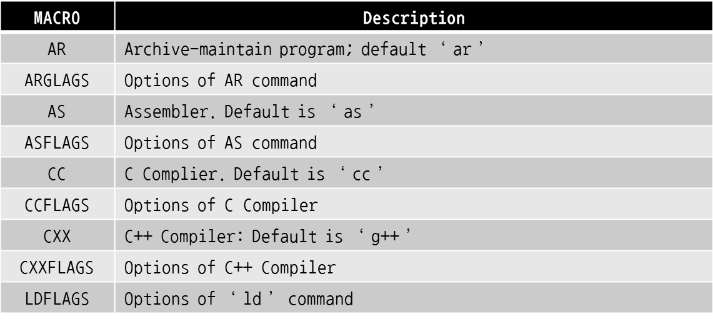

## report12

### 이론
  * Make (GNU make)
    * 배경
      * `.h`, `.c`와 같이 많은 소스파일이 존재하며 이를 관리하는 것엔 어려움이 있다.
      * 컴파일링에도 이와 같은 어려움이 존재한다.
        * different target system
        * different purpose of compiling - debug, release(`-m32`, `-m64`), preprocessor...
        * compile what we need to
        * **dependency**
      * 이러한 어려움을 해결하고자 make를 사용한다.

    * make 사용법
      * target 생성(보통 생성될 파일)
      * 각각의 tartget에 dependency 명시
      * dependency에서 target을 생성하는 명령어 지정
      * make는 dependecy에서 재귀적으로 target을 build한다.
      * time-stamp가 바뀐다면 recompilation이 발생
        * time-stamp를 갱신하는 명령어: `touch <파일이름>` (해당하는 파일이 없으면 생성)
    
    * Makefile
      * Makefile 안에서 target에 대해 make를 만드는 방법은 다음과 같다.
        ```
        target ($@) dependency files ($< $^ $?)
                Execute if dependency changes
        ```
        * 두 번째 줄의 공백은 반드시 **tab**을 이용해야 한다.
        * 예:
        ```
        main.o: main.c main.h
            cc -c main.c -o main.o
        ```
      
      * Macro
        * 프로그램을 작성할 때 변수를 지칭하는 것처럼 사용
        * `$(...)`을 통해 사용 가능
        * 예:
        ```
        OBJS = main.o main.h
        main.o: $(OBJS)
        ```
      
      * Automatic Variables

        

      * Pre-defined Macro
          

    * CMake (cmake.org)
      * build system generator
      * build, test, package C++ project를 쉽게 만들어준다.
      * shell command에 기반한 make는 큰 project에 한계가 있어 CMake가 탄생했다.
      * 기본적으로 제공하지 않아 추가적인 설치가 필요하다. (command: `sudo apt install cmake`)

### 실습

  * Makefile
    * `cp /tmp/lec12/* .`을 이용해 실습에 필요한 파일들을 현재 디렉토리에 복사한다.
    * 복사한 여러 개의 실행파일을 쉽게 컴파일 및 관리하기 위해 `vi Makefile`을 통해 Makefile의 내용을 다음과 같이 수정한다.
      ```
      main: main.c fx_s15_16.c fx_head.h fx_s15_16.h
	      cc main.c fx_s15_16.c -o main
      ```

    * `make`를 입력하면 실행파일 `main`이 생성되며 shell에 `main`을 입력하면 실행 결과를 확인할 수 있다. 또 다시 make를 입력하면 recompile되지 않는다.
      ```
      $ make
      cc main.c fx_s15_16.c -o main
      $ main
      1.000000 : 65536
      0.390000 : 0.389969
      $ make
      make: 'main' is up to date.
      ```

    * recompile을 시키기 위한 방법으로는 실행파일을 삭제하거나, `touch` 명령어를 통해 time-stamp를 갱신하는 방법이 있따.
      ```
      $ make
      make: 'main' is up to date.
      $ rm main
      $ make
      cc main.c fx_s15_16.c -o main
      $ make
      make: 'main' is up to date.
      $ ls -al
      total 64
      drwxr-xr-x  2 pcc009 pcc 4096  1월 24 14:20 .
      drwxr-xr-x 16 pcc009 pcc 4096  1월 24 13:31 ..
      -rwxr-xr-x  1 pcc009 pcc 8376  1월 24 13:59 a.out
      -rw-r--r--  1 pcc009 pcc 3235  1월 24 13:35 fx_head.h
      -rw-r--r--  1 pcc009 pcc  131  1월 24 13:35 fx_s15_16.c
      -rw-r--r--  1 pcc009 pcc 1418  1월 24 13:50 fx_s15_16.h
      -rw-r--r--  1 pcc009 pcc 1544  1월 24 13:58 fx_s15_16.o
      -rwxr-xr-x  1 pcc009 pcc 8376  1월 24 14:19 main
      -rw-r--r--  1 pcc009 pcc  216  1월 24 14:19 main.c
      -rw-r--r--  1 pcc009 pcc 1872  1월 24 13:58 main.o
      -rw-r--r--  1 pcc009 pcc   78  1월 24 14:15 Makefile
      -rw-r--r--  1 pcc009 pcc 1002  1월 24 13:35 test2.c
      $ touch main.c
            $ ls -al
      total 64
      drwxr-xr-x  2 pcc009 pcc 4096  1월 24 14:20 .
      drwxr-xr-x 16 pcc009 pcc 4096  1월 24 13:31 ..
      -rwxr-xr-x  1 pcc009 pcc 8376  1월 24 13:59 a.out
      -rw-r--r--  1 pcc009 pcc 3235  1월 24 13:35 fx_head.h
      -rw-r--r--  1 pcc009 pcc  131  1월 24 13:35 fx_s15_16.c
      -rw-r--r--  1 pcc009 pcc 1418  1월 24 13:50 fx_s15_16.h
      -rw-r--r--  1 pcc009 pcc 1544  1월 24 13:58 fx_s15_16.o
      -rwxr-xr-x  1 pcc009 pcc 8376  1월 24 14:19 main
      -rw-r--r--  1 pcc009 pcc  216  1월 24 14:23 main.c
      -rw-r--r--  1 pcc009 pcc 1872  1월 24 13:58 main.o
      -rw-r--r--  1 pcc009 pcc   78  1월 24 14:15 Makefile
      -rw-r--r--  1 pcc009 pcc 1002  1월 24 13:35 test2.c
      $ make
      cc main.c fx_s15_16.c -o main
      ```

    * recompile을 더욱 쉽게하기 위한 방법으로 기존의 실행파일을 삭제하는 `clean`을 Makefile에 추가했다.
      ```
      main: main.c fx_s15_16.c fx_head.h fx_s15_16.h
	      cc main.c fx_s15_16.c -o main
      clean: 
	      rm main *.o *.out
      ```
      ```
      $ make clean
      rm main *.o *.out
      $ ls -al
      total 32
      drwxr-xr-x  2 pcc009 pcc 4096  1월 24 14:27 .
      drwxr-xr-x 16 pcc009 pcc 4096  1월 24 13:31 ..
      -rw-r--r--  1 pcc009 pcc 3235  1월 24 14:24 fx_head.h
      -rw-r--r--  1 pcc009 pcc  131  1월 24 13:35 fx_s15_16.c
      -rw-r--r--  1 pcc009 pcc 1418  1월 24 14:24 fx_s15_16.h
      -rw-r--r--  1 pcc009 pcc  216  1월 24 14:23 main.c
      -rw-r--r--  1 pcc009 pcc  105  1월 24 14:26 Makefile
      -rw-r--r--  1 pcc009 pcc 1002  1월 24 13:35 test2.c
      $ make
      cc main.c fx_s15_16.c -o main
      ```

    * dependency를 가진 파일들끼리 묶어 실행파일을 만드는 것도 가능하다.
      ```
      main: main.o fx_s15_16.o
	      cc main.o fx_s15_16.o -o main
      main.o: main.c fx_head.h fx_s15_16.h
	      cc -c main.c
      fx_s15_16.o: fx_head.h fx_s15_16.c
	      cc -c fx_s15_16.c
      clean: 
	      rm main *.o *.out
      ```
      ```
      $ make
      cc -c main.c
      cc -c fx_s15_16.c
      cc main.o fx_s15_16.o -o main
      ```

    * 위의 Makefile에서 macro를 사용하여 보다 간단하게 작성할 수 있다. (`$(..)`: target, `$<`: dependencies 중 첫 번째 파일)
      ```
      OBJS = main.o fx_s15_16.o
      CCFLAGS = -Wall -g -pg
      main: $(OBJS)
	      cc $(OBJS) $(CCFLAGS) -o $@
      main.o: main.c fx_head.h fx_s15_16.h
	      cc -c $(CCFLAGS) $<
      fx_s15_16.o: fx_s15_16.c fx_s15_16.h
	      cc -c $(CCFLAGS) $<
      clean: 
	      rm main $(OBJS)
      ```

    * `gccmakdep`은 소스파일의 의존성을 검사하여 Makefile 마지막 부분에 관련한 파일을 나열해준다.
      ```
      $ gccmakedep main.c fx_s15_16.c
      $ cat Makefile
      BJS = main.o fx_s15_16.o
      CCFLAGS = -Wall -g -pg
      main: $(OBJS)
	      cc $(OBJS) $(CCFLAGS) -o $@
      .c.o:
	      cc -c $(CCFLAGS) $<
      debug: main.c fx_s15_16.c fx_s15_16.h fx_head.h
	      cc -o main_for_debug -pg -g main.c fx_s15_16.c
      clean: 
	      rm main $(OBJS)
      # DO NOT DELETE
      main.o: main.c /usr/include/stdc-predef.h fx_head.h fx_s15_16.h \
      /usr/include/math.h \
      /usr/include/x86_64-linux-gnu/bits/libc-header-start.h \
      /usr/include/features.h /usr/include/x86_64-linux-gnu/sys/cdefs.h \
      /usr/include/x86_64-linux-gnu/bits/wordsize.h \
      /usr/include/x86_64-linux-gnu/bits/long-double.h \
      ...
      ```
  
  * CMake
    * `cmake`를 사용하기 전에 의존성을 추가하기 위해 아래와 같이 `CMakeLists.txt`를 작성한다.
      ```
      project(main)
      ADD_EXECUTABLE(main main.c fx_s15_16.c)
      ```
    
    * shell에 `cmake .`를 입력하면 컴파일을 통해 cmake와 make에 관련한 파일들이 생성된다.
      ```
      $ cmake .
      -- The C compiler identification is GNU 7.5.0
      -- The CXX compiler identification is GNU 7.5.0
      -- Check for working C compiler: /usr/bin/cc
      -- Check for working C compiler: /usr/bin/cc -- works
      -- Detecting C compiler ABI info
      -- Detecting C compiler ABI info - done
      -- Detecting C compile features
      -- Detecting C compile features - done
      -- Check for working CXX compiler: /usr/bin/c++
      -- Check for working CXX compiler: /usr/bin/c++ -- works
      -- Detecting CXX compiler ABI info
      -- Detecting CXX compiler ABI info - done
      -- Detecting CXX compile features
      -- Detecting CXX compile features - done
      -- Configuring done
      -- Generating done
      -- Build files have been written to: /home/course/pcc009/pcc/lec12/cmaketest
      $ ls -al
      total 64
      drwxr-xr-x 3 pcc009 pcc  4096  1월 24 15:20 .
      drwxr-xr-x 3 pcc009 pcc  4096  1월 24 15:17 ..
      -rw-r--r-- 1 pcc009 pcc 12628  1월 24 15:20 CMakeCache.txt
      drwxr-xr-x 5 pcc009 pcc  4096  1월 24 15:20 CMakeFiles
      -rw-r--r-- 1 pcc009 pcc  1524  1월 24 15:20 cmake_install.cmake
      -rw-r--r-- 1 pcc009 pcc    54  1월 24 15:19 CMakeLists.txt
      -rw-r--r-- 1 pcc009 pcc  3235  1월 24 15:17 fx_head.h
      -rw-r--r-- 1 pcc009 pcc   131  1월 24 15:17 fx_s15_16.c
      -rw-r--r-- 1 pcc009 pcc  1418  1월 24 15:17 fx_s15_16.h
      -rw-r--r-- 1 pcc009 pcc   216  1월 24 15:17 main.c
      -rw-r--r-- 1 pcc009 pcc  5413  1월 24 15:20 Makefile
      -rw-r--r-- 1 pcc009 pcc  1002  1월 24 15:17 test2.c
      $ make
      Scanning dependencies of target main
      [ 33%] Building C object CMakeFiles/main.dir/main.c.o
      [ 66%] Building C object CMakeFiles/main.dir/fx_s15_16.c.o
      [100%] Linking C executable main
      [100%] Built target main
      ```