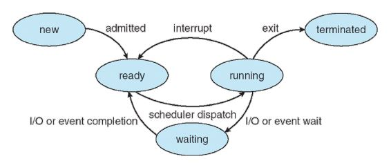

## report13

### 이론
  * Thread and System call
    * Process
      * 컴퓨터에서 연속적으로 실행되고 있는 컴퓨터 프로그램을 말한다. (=task)
      * 각각의 프로세스는 id를 가지며 parent-child 구조를 갖는다.
      * linux 명령어 `ps`와 `jobs`로 확인이 가능하다.
      * OS의 프로세스는 system process, 이외의 프로세스는 user process라 한다.
      * 프로세스에는 크게 3가지 상태가 있다.
        1. run(fg, bg)
        2. kill(idle)
        3. stop

        
  
      * 프로세스는 back ground(bg)와 fore ground(fg)라는 두가지 모드 중 하나로 작동한다.
        * fg: 유저와 상호작용을 하게되는 프로세스로 `ctrl+z`를 통해 실행 중인 프로세스를 stop상태로 만들 수 있다.
        * bg: 유저에게 보이지 않는 형태로 동작하는 프로세스로 명령어 뒤에 `&`을 붙여 실행이 가능하다.
        * stdin(scanf, fscanf, ...)이 존재하는 프로그램을 back ground에서 실행한다면 자동으로 stop 상태가 된다.

    * Context switch
      * 프로세스들을 바꿔가며 수행
      * 한정적인 CPU에서 여러가지 작업을 동시에 수행하기 위한 방법
      * processs scheduling: 다음에 수행할 프로세스를 정하는 과정
      * 메모리가 부족할 때 disk의 일부분을 Virtual memory로 만들어 사용
      * switch에 발생하는 Overhead가 크다. -> Thread

    * Thread
      * 프로세스 내에서 실행되는 흐름의 단위를 말한다.
      * Multithreading: CPU가 한 프로세스의 여러 작업을 동시에 실행하도록 하는 기술 (thread는 여러개의 CPU에서 돌아갈 수 있다.)
      * 한 프로세스는 여러 개의 Thread를 가질 수 있다.
      * 한 개의 core를 나누어 여러 개의 쓰레드를 동시에 작업할 수 있다.
        
        

      * Thread들은 같은 address space를 공유한다.
      * Windows 계열에서는 `thread.h`(C11), UNIX와 Linux 계열에서는 `pthread.h`(POSIX)를 include하여 사용이 가능하다.
      * thread를 사용한 파일의 컴파일 명령어는 `cc <컴파일 할 파일이름> -lpthread`이다.
      * pthread.h API
        * int pthread_create(pthread_t *thread, const pthread_attr_t *attr, void *(*start_routine) (void *), void *arg);

          -생성 함수 start_routine을 실행
        * void pthread_exit(void *retval);

          -retval must not in stack

          -main thread exit with this, other threads are still running
        * int pthread_join(pthread_t thread, void **retval);

          -thread들의 synchronization을 수행
        * void pthread_cancel(pthread_t thread);

          -Send cancellation request to thread
        * pthread_t pthread_self(void);

          -return ID of the calling thread
        * int pthread_equal(pthread_t t1, pthread_t t2);

          -compare thread IDs

      * fork
        * 현재 프로세스를 복사 (pid는 다름)
        * `<sys/types.h>`와 `<unistd.h>`를 inlcude 해야함
        * pid_t fork(void);

      * Core vs Thread
        

    * System Call
      * 하드웨어와 직접 상호 작동하며 프로그램에게 일관된 서비스를 제공
      * `stdlib.h`를 include하여 사용 가능
      * int system(const char *command); 
      
        -명령어를 실행하고 return
      * int execl(const char *path, const char *arg, ...);

        -다른 프로그램을 실행하고 자신은 종료
      * `sh`을 입력하고 명령어를 실행시킨 것과 동일하다.
 
### Vi editor
  * Command mode에서 `!`를 이용하여 명령어를 실행하는 것이 가능하다.
    
    e.g) `:!ls -al`
  * Command mode에서 `r <파일>`을 이용하면 파일을 읽어 현재 커서 위치에 내용을 추가할 수있다.

    e.g)`:r output.txt`, `:r !ls -al`

  * Command mode에서 `set tabstop=<숫자>`을 통해 tab의 간격을 조절할 수 있다.

    e.g)`:set tabstop=4`

### 실습
  * Process
    * 프로세스 중지 및 실행
      1. `vi test.c`를 입력하여 vi editor를 실행한다.
      2. vi editor 창에서 `ctrl+z`를 통해 vi editor를 stop상태로 만든다. (`ps`명령어를 통해 확인 가능)
          ```
          $ vi test.c

          [1]+  Stopped                 vi test.c
          $ ps -l
          F S   UID   PID  PPID  C PRI  NI ADDR SZ WCHAN  TTY          TIME CMD
          0 T  4009  6245 27904  0  80   0 - 14192 signal pts/10   00:00:00 vi
          0 R  4009  6502 27904  0  80   0 -  7551 -      pts/10   00:00:00 ps
          0 S  4009 27904 27903  0  80   0 -  6054 wait   pts/10   00:00:00 bash
          ```
      3. `fg`를 입력하여 다시 vi editor를 run 상태로 만들 수 있다. (**vi editor의 경우 stdin을 필요로 하기때문에 `bg`로 실행시킬 수 없다.**)
    * 백그라운드 실행 및 종료
      1. `sleep <time> &`을 통해 백그라운드로 `sleep` 명령어를 실행한다.
          ```
          $ sleep 3600 &
          [1] 9524
          ```
      2. `kill %`을 이용하여 실행중인 프로세스를 종료할 수 있다.
          ```
          $ kill %1
          $ ps
            PID TTY          TIME CMD
           9543 pts/10   00:00:00 ps
          27904 pts/10   00:00:00 bash
          ```
    
    * stdin에 들어갈 값 미리 입력하여 백그라운드로 실행이 가능하다.
      1. lec06에 사용했던 `bin` 실행파일을 사용한다. 입력값 없이 백그라운드 실행 시 중단된다.
          ```
          $ bin &
          [1] 10148
          $ bg
          [1]+ bin &

          [1]+  Stopped                 bin
          ```
      2. `<<<`을 통해 입력값을 지정해준뒤 백그라운드 실행 시 정상적으로 작동한다.
          ```
          $ bin <<< 9988 &
          [1] 10249
          $ 9988     : 0000 0000 0000 0000 0010 0111 0000 0100

          [1]+  Done                    bin <<< 9988
          ```

    * fork
      * 아래와 같이 `forktest.c`를 작성하고 컴파일 및 실행을 한다.
          ```c
          #include <stdio.h>
          #include <sys/types.h>
          #include <unistd.h>

          int main()
          {
              int a = 0;
              pid_t pid;
              pid = fork();
              for (int i = 0; i < 100; i++)
              {
                  sleep(1) ;
                  printf("PID %d A=%d i=%d : \n", pid, a++, i);
              }
          }
          ```
          결과: 프로세스를 복제하여 2개의 프로세스에서 1초에 한 번씩 a값을 늘려가며 출력된다.
          ```
          $ a.out
          PID 24394 : A = 0 : i = 0
          PID 0 : A = 0 : i = 0
          PID 24394 : A = 1 : i = 1
          PID 0 : A = 1 : i = 1
          PID 24394 : A = 2 : i = 2
          PID 0 : A = 2 : i = 2
          PID 24394 : A = 3 : i = 3
          PID 0 : A = 3 : i = 3
          PID 24394 : A = 4 : i = 4
          .
          .
          .
          PID 0 : A = 99 : i = 99
          PID 24394 : A = 99 : i = 99
          ```
      
      * 아래와 같이 `forktest.c`를 수정하고 컴파일 및 실행을 한다.
          ```c
          #include <stdio.h>
          #include <sys/types.h>
          #include <unistd.h>

          int main()
          {
              int a = 0;
              pid_t pid;
              pid = fork();
              for (int i = 0; i < 100; i++)
              {
                  sleep(1) ;
                  if (pid == 0)
                    printf("PID %d A=%d i=%d : \n", pid, a++, i);
                  else
                    printf("PID %d A=%d i=%d : \n", pid, a--, i);
              }
          }
          ```
          결과: 한 프로세스에서의 a는 증가하는 반면 다른 프로세스에서는 a가 감소한다.
          ```
          $ a.out
          PID 25391 : A = 0 : i = 0
          PID 0 : A = 0 : i = 0
          PID 25391 : A = -1 : i = 1
          PID 0 : A = 1 : i = 1
          PID 25391 : A = -2 : i = 2
          PID 0 : A = 2 : i = 2
          PID 25391 : A = -3 : i = 3
          PID 0 : A = 3 : i = 3
          .
          .
          .
          ```
      
      * pid2를 새로 fork하는 내용을 추가한다
          ```c
          #include <stdio.h>
          #include <sys/types.h>
          #include <unistd.h>

          int main()
          {
              int a = 0;
              pid_t pid;
              pid  = fork();
              pid2 = fork();
              for (int i = 0; i < 100; i++)
              {
                  sleep(1) ;
                  printf("PID %d : PID2 %d : A=%d i=%d : \n", pid, pid2, a++, i);
              }
          }
          ```
          결과: fork를 통해 2개의 만들어지고 또 다시 두 개의 프로세스가 fork되므로 총 4개의 프로세스 가 실행된다.
          ```
          $ a.out
          PID 26296 : PID2 26297 : A = 0 : i = 0
          PID 26296 : PID2 0 : A = 0 : i = 0
          PID 0 : PID2 0 : A = 0 : i = 0
          PID 0 : PID2 26298 : A = 0 : i = 0
          PID 26296 : PID2 26297 : A = 1 : i = 1
          PID 0 : PID2 0 : A = 1 : i = 1
          PID 26296 : PID2 0 : A = 1 : i = 1
          PID 0 : PID2 26298 : A = 1 : i = 1
          .
          .
          .
          ```
 
  * Thread
    * 아래와 같이 `threadtest.c`를 작성하고 `-lpthread`옵션을 추가하여 컴파일 및 실행한다. (`fn_s`의 printf에서 \n이 있어야 1초에 하나씩 출력함 -> lec14 참고)
        ```c
        #include <pthread.h>
        #include <stdio.h>
        #include <sys/types.h>
        #include <unistd.h>
        #include <stdlib.h>


        int bbb = 0; 

        void fn_s()
        {
            static int a = 0; 
            printf("== %d %d ==\n",a++, bbb++);
        }

        void *run (void *arg)
        {
            printf("Hello world of POSXI threads.%d\n", (int) pthread_self() );
            for (int i = 0; i < 100; i++)
	        {
		        sleep(1); 
		        fn_s(); 
	        }
          return 0;
        }

          int main()
        {
	        pthread_t thread1;
	        int result1;
	        pthread_create(&thread1, NULL, run, NULL );
	        run((void *) 0); 
	        pthread_join(thread1, (void **) &result1);
	        printf("Thread return %d at the end\n", result1);
        }
        ```
        결과
        ```
        Hello world of POSIX threads.0
        == 0 0 ==
        == 1 1 ==
        == 2 2 ==
        == 3 3 ==
        .
        .
        .
        ```


  * System Call
    * 아래와 같이 `test.c`을 작성하고 컴파일 및 실행을 한다.
        ```c
        #include <stdio.h>
        #include <stdlib.h> // system 함수를 사용하기 위해 필요

        int main() 
        {
	        printf("System Call: %d\n", system("ls -li"));
        }
        ```
        결과: `system`을 정상적으로 종료하였기 때문에 0이 출력된다.
        ```
        $ a.out
        total 20
        31327639 -rwxr-xr-x 1 pcc009 pcc 8344  1월 25 15:19 a.out
        31327651 -rw-r--r-- 1 pcc009 pcc    6  1월 25 15:10 output.txt
        31327674 -rw-r--r-- 1 pcc009 pcc  104  1월 25 15:19 test.c
        System Call: 0
        ```
    * `test.c`의 ls -li 뒤에 zzz를 추가하여 컴파일 및 실행을 한다.
        결과: zzz 파일이 존재하지 않기 때문에 `system`에서 error가 발생하고 512가 return된다.
        ```
        $ a.out
        ls: cannot access 'zzz': No such file or directory
        System Call: 512
        ```
  
  * Redirection
    * `ls -l`의 뒤에 현재 directory에 존재하는 파일과 존재하지 않는 파일의 이름을 붙여 입력한다.
        ```
        $ ls -l zzz test.c
        ls: cannot access 'zzz': No such file or directory
        -rw-r--r-- 1 pcc009 pcc  104  1월 25 15:19 test.c
        ```
    * zzz 파일은 존재하지 않기 때문에 해당 내용은 stderr을 통해 출력되고, `test.c` 파일은 존재하기 때문에 stdout으로 출력된다.
        ```
        $ ls -l zzz test.c > lsout.txt
        ls: cannot access 'zzz': No such file or directory
        $ cat lsout.txt
        -rw-r--r-- 1 pcc009 pcc  104  1월 25 15:19 test.c

        $ ls -l zzz test.c 2> lserr.txt
        -rw-r--r-- 1 pcc009 pcc  104  1월 25 15:19 test.c
        $ cat lserr.txt
        ls: cannot access 'zzz': No such file or directory

        $ ls -l zzz test.c 1> lsout.txt 2> lserr.txt
        $ cat lsout.txt
        -rw-r--r-- 1 pcc009 pcc  104  1월 25 15:19 test.c
        $ cat lserr.txt
        ls: cannot access 'zzz': No such file or directory
        $ ls -l zzz test.c &> lsoutierr.txt

        $ cat lsoutierr.txt
        ls: cannot access 'zzz': No such file or directory
        -rw-r--r-- 1 pcc009 pcc  104  1월 25 15:19 test.c
        ```


  
        

