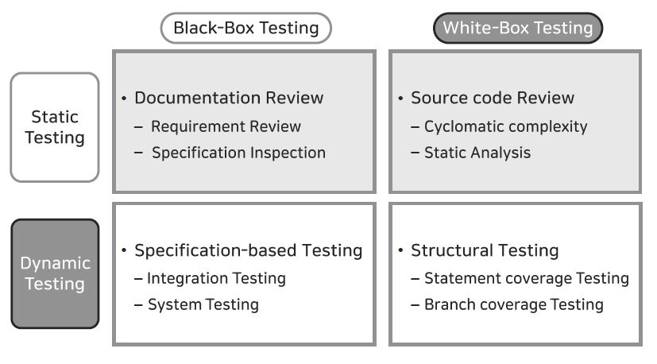
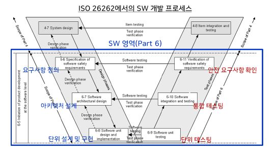

## report15

### 이론

  * 소프트웨어 테스트
    * 소프트웨어 개발 과정에서 발생할 수 있는 오류들을 가정하고, 그러한 오류들을 발견해 내는 활동
    * 소프트웨어의 내부 구조 파악 여부
      * White Box
        * 소스 코드의 구조를 기반으로 테스트를 수행하는 기법
        * 코드의 수행 경로, 불필요한 코드 혹은 테스트 되지 못한 부분을 확인
      * Black Box
        * 소프트웨어의 내부를 보지 않고 기능의 유효성을 판단하는 테스트 기법
    * 소프트웨어의 실행 여부
      * Static (정적)
        * 프로그램을 실행하지 않고 소스 코드 전체 또는 일부를 분석하는 기법
      * Dynamic (동적)
        * SW를 실행하여 다양한 입력 값에 대해 기대하는 결과 값이 나타나는지 확인하는 테스트 기법

    

    * V-model
      * 요구 사항 분석에서의 오류, 설계 등 개발 단계의 작업들에 대한 테스트를 포함한다는 내용을 개발 프로세스와 통합하여 체계화한 개념.
      * V-model은 소프트웨어 생명 주기를 모형화한 것으로 기존의 폭포수 모델(Waterfall Model)에서 시스템 검증과 테스트 작업을 강조함.
    
    

    * 기능안전
      * 기능안전은 시스템이나 장비의 총체적 안전의 일환으로 하드웨어 고장, 소프트웨어 오류, 운영자 오류 그리고 환경적인 영향 등에 대한 안전 관리를 뜻함.

### 실습
  * 슈어소프트에서 제공하는 "CodeScroll Code inspector 3.7"과 "CodeScroll Controller"를 통해 정적 테스팅과 동적 테스팅을 진행했다. (`test.c` 이용)
    1. 정적테스팅

      코드들이 지정한 인스펙션(MISRA-C)에 위배되는 지 확인하여 보고서로 추출

        [인스펙션 결과1](https://git.ajou.ac.kr/HanSeong/pcc009/-/blob/main/lec15/violations.pdf)

        [인스펙션 결과2](https://git.ajou.ac.kr/HanSeong/pcc009/-/blob/main/lec15/violations_suppressed.pdf)

    2. 동적테스팅
    
      구문 커버리지를 고려하며 조건문에 들어갈 변수의 값들을 바꾸어 가며 테스팅을 진행
      
        [제어 흐름 그래프](https://git.ajou.ac.kr/HanSeong/pcc009/-/blob/main/lec15/graph.pdf)

    
    